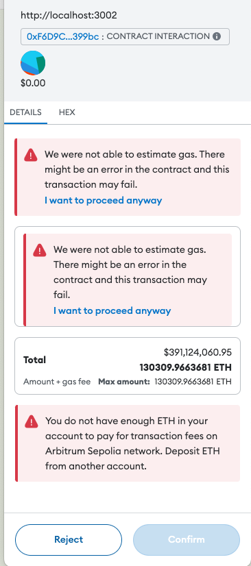
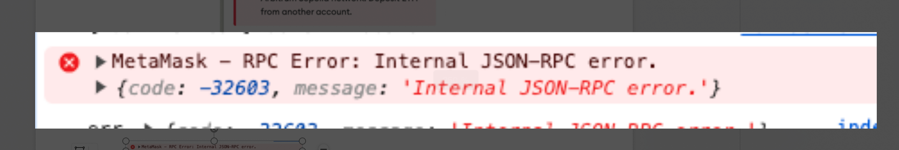
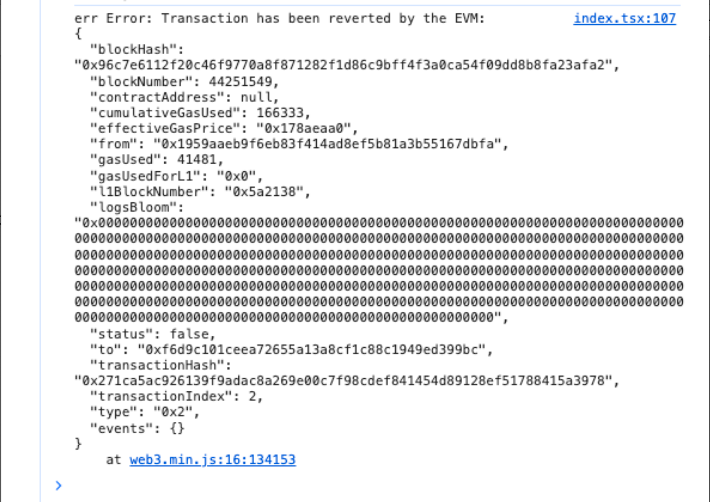
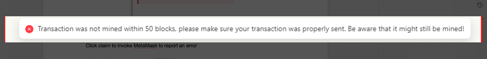

Start the demo with the following command.
```
yarn install
yarn start
```


1. In the index.tsx file, on line 104, remove `gas:3000`, and the problem of unusually high gas charges will occur frequently




2. Keeping the `gas:3000` parameter on line 104 of the index.tsx file results in frequent internal json-rpc errors

   


3. The following two errors occur less frequently.

   

   
